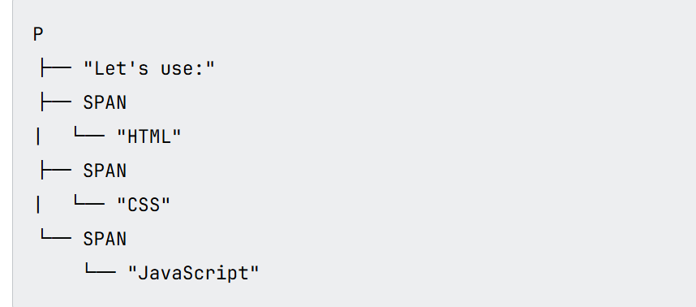

# 浏览器如何加载网站

1. 浏览器输入 URL 后，会先查缓存，再做 DNS 解析拿到 IP，通过 TCP 三次握手建立连接；若是 HTTPS 会进行 TLS 握手。
2. 创建连接后发送 HTTP 请求，服务器返回 HTML。
3. 浏览器开始解析 HTML 构建 DOM，解析 CSS 构建 CSSOM，再合成渲染树。
4. 执行 Layout 和 Paint，将像素绘制到屏幕上。

## HTTP 响应返回的文件类型

- html 文件
- css 文件
- JavaScript 文件
- 媒体文件：如图片、视频、音频、SVG、PDF
- 其他浏览器原生无法处理的文件类型

## 网页渲染

当用户打开一个新 web 页面的时候会发送若干 HTTP Request，Http Response 会返回各种文件。浏览器会处理这些文件，然后统一放到一个用户可以与之交互的 web 页中，这个组装过程叫做**rendering(渲染)**。

## HTML 处理

HTML 文件包含了 web 页内容和结构,最终浏览器会将其转换为 DOM 的树形结构。每一个元素、属性、文本都是 DOM 树上的一个 DOM 节点。

部分特定元素在解析时会触发 http 请求，如：

- link 标签:外部 css 文件
- script 标签：外部 js 文件
- 嵌入网页的媒体标签，如 img,video

## CSS 解析

浏览器会解析页面中的 CSS（无论是直接写在 HTML 文件中，还是从外部样式表中引入），并根据这些样式规则将它们分类到不同的“桶”（buckets）中，以确定它们将应用于哪些 HTML 元素。

接着浏览器会根据需要将相应的样式附加到各个元素上，这个中间步骤称为构建 **渲染树（render tree）**

浏览器根据渲染树，计算出每个元素在屏幕上的确切位置和大小。这一步也叫 **reflow（回流）** 或 **layout（布局）**。

页面的视觉内容会被绘制到屏幕上，这个阶段称为 **绘制（painting）**。

### 渲染树包含内容

1. 需要显示的元素（不可见的例如 head 标签，不会出现在这里）。
2. 每个元素的计算后样式（颜色、大小、字体等）。

整体流程如图所示：

## JS 处理

CSS 处理完成后，JS 文件会被解析、解释（V8 引擎）、编译和执行，这些行为发生在最终渲染完成之前。原因是一些 js 执行会影响渲染，比如向 DOM 新增节点或者修改某个节点。
