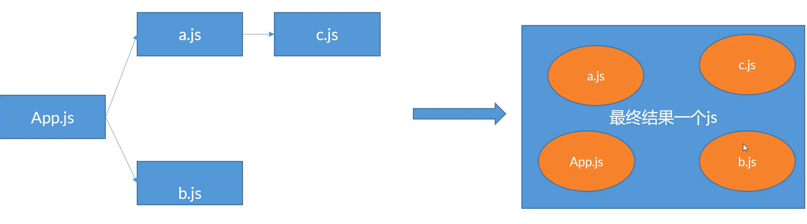

# 构建工具

## 作用

- 编译浏览器无法理解的内容：es6,ts,jsx,vue
- 代替部分人工操作：文件合并/拆分，图片压缩，资源处理
- 帮助开发：开发模式提供多种便利

## webpack 基础配置

webpack 本身只做**打包**，将多个文件生成一个 js 文件


## 分类

### 必须项

- mode:`development`/`production`
- entry:入口文件
- output:最终产出的 js 配置

### 非必须项

- devServer：开发模式下的配置
- **module**：loader 编写的地方
- **plugins**：插件
- optimization：优化相关
- resolve：提供一些简化功能

## 基础配置

```js
module.exports = {
  mode: "development",
  entry: {
    app: ["./index.js"],
  },
  output: {
    path: __dirname + "/dist",
    filename: "[name].[contenthash:4].bundle.js",
  },
  module: {
    rules: [{}],
  },
  plugins: [],
  optimization: {},
  resolve: {},
  devServer: {},
};
```
