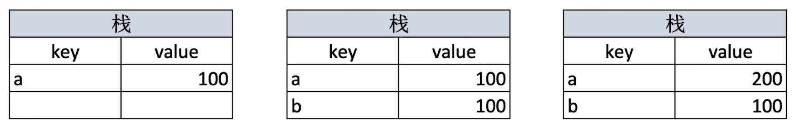
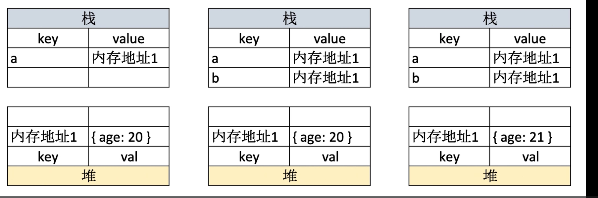

# 变量类型和计算

## 变量类型

按照 ES6 标准划分：

1. 基本类型：string,number,boolean,bigint,symbol,undefined,null
2. 对象类型: object,array,function

### 数据类型

按照存储划分:

1. 值类型：变量值存储在向下生长的栈中，比如除了 null 以外的基本数据类型
   
2. 引用类型：栈上的变量保存的是“指向堆中对象的地址”，而非对象本体，对象实际被保存在向上生长的堆中，比如对象、数组；null 是特殊引用类型，但指针指向空地址
   
3. 函数类型：特殊的引用类型

```javascript
let a = 100;
let b = a;
a = 300;
console.log(b); //100，修改变量值不会互相干扰

let c = { age: 299 };
let d = c;
d.age = 100;
console.log(c); //{age:100},修改变量值会互相干扰
```

> 之所以需要分开存储是因为对象通常需要占用很大内存，只有堆能满足。

### typeof

1. 识别所有的值类型和函数类型
2. 识别是否为引用类型，但无法具体到数组或者对象

### 引用类型的浅拷贝/深拷贝

- 浅拷贝:只能复制对象或数组的第一层属性/元素，修改深层属性会互相影响
  - 展开运算符 `const a={...b}`
  - Object.assign()方法
- 深拷贝:会复制对象或数组的所有属性/元素，修改深层元素属性不会互相影响

  - `​​lodash.cloneDeep()`:适合大型项目使用
  - `structuredClone()`：适合现代浏览器/Node.js 环境中需要可靠深拷贝且不含函数的场景
  - 手动递归复制
  - ​`​JSON.parse(JSON.stringify(obj))​​`:只适合简单对象或数组的深拷贝，不适合有函数、特殊对象、循环引用或复杂原型链的场景

::: danger

1. 无法拷贝函数、undefined 以及 symbol,null 和普通值可以正常拷贝
2. 循环引用会报错
3. 特殊对象类型丢失：Date 变成字符串，Regexp/map/set 变成普通对象或者丢失
4. 丢失原型链
5. 大对象或深层对象，先序列化再解析，性能开销大。
   :::

手动递归复制存在循环引用问题，会出现栈溢出报错，可以使用 weakMap 解决
::: code-group

```javascript [递归复制]
function deepClone(obj, visited = new WeakMap()) {
  // 基本类型或函数：直接返回
  if (obj === null || typeof obj !== "object") return obj;

  // 断环：已访问过则直接复用副本
  if (visited.has(obj)) return visited.get(obj);

  // 创建新容器并先登记，避免子递归时重复进入造成栈溢出
  const copy = Array.isArray(obj) ? [] : {};
  visited.set(obj, copy);

  // 仅遍历自有可枚举属性（不走原型链、不处理 Symbol）
  for (const key in obj) {
    if (Object.hasOwn(obj, key)) {
      copy[key] = deepClone(obj[key], visited);
    }
  }

  return copy;
}
```

```javascript [迭代]
function cloneT(o) {
  return Array.isArray(o) ? [] : {};
}
function copy2(obj) {
  if (typeof obj !== "object" || obj === null) return obj;

  const cache = new WeakMap(); // 源对象 -> 副本的映射，断环并保同一性
  const tasks = []; // 待处理的源对象队列

  // 创建根副本并建立映射
  const cp = Array.isArray(obj) ? [] : {};
  cache.set(obj, cp);
  tasks.push(obj);

  while (tasks.length) {
    const src = tasks.shift(); // 取出一个源对象
    const dst = cache.get(src); // 取出已创建的唯一副本

    // 遍历其所有可枚举自有属性（不含 Symbol）
    for (const key in src) {
      if (!Object.hasOwn(src, key)) continue;

      const v = src[key];

      if (v !== null && typeof v === "object") {
        if (cache.has(v)) {
          // 已访问过：直接复用同一副本
          dst[key] = cache.get(v);
        } else {
          // 首次访问：创建对应类型的空壳并建立映射，再入队继续处理
          const child = Array.isArray(v) ? [] : {};
          cache.set(v, child); // 👈 关键：先登记，再入队
          dst[key] = child;
          tasks.push(v);
        }
      } else {
        // 基本类型直接赋值
        dst[key] = v;
      }
    }
  }

  return cp;
}
```

:::

## isEqual

1. 判断是否是两个 object
2. 以 obj1 为基准,依次递归比较

```js
function isObject(obj) {
  return typeof obj === "object";
}
function isEqual(obj1, obj2) {
  if (!isObject(obj1) || !isObject(obj2)) return obj1 === obj2;
  if (obj1 === obj2) return true;

  const obj1Len = Object.keys(obj1);
  const obj2Len = Object.keys(obj2);

  if (obj1Len !== obj2Len) return false;

  for (let key in obj1) {
    const res = isEqual(obj1[key], obj2[key]);
    if (!res) return false;
  }

  return true;
}
```

## 纯函数

定义：没有副作用、且返回结果只依赖输入参数的函数

副作用：

1. 修改全局变量或外部作用域变量
2. 修改参数对象
3. 进行 I/O 操作（如读写文件、打印日志、发请求）
4. 修改 DOM
5. 调用非纯函数

## 数组

纯函数：map,slice

非纯函数：splice,push,pop

## js 的垃圾回收机制

自动回收，核心原则是**不再被引用的对象**会被回收。现代引擎主要用可达性分析（标记清除）算法：从根对象出发，无法访问的对象会被标记为垃圾并清理掉。历史上还有引用计数算法，但循环引用无法回收。浏览器和 Node 通常采用分代回收：新生代快速回收短生命周期对象，老生代回收长期存活对象。开发者需要注意避免全局变量、闭包或大对象的无用引用，以防内存泄漏。
