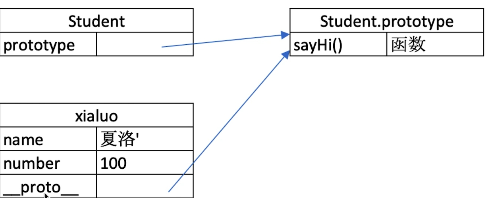
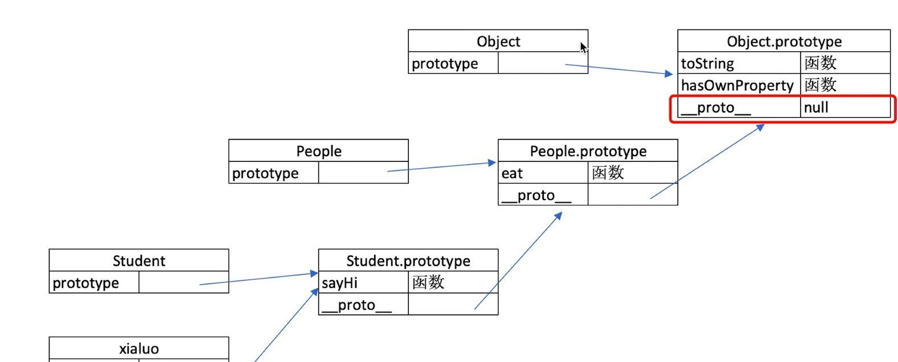

# 原型和原型链

## class 和继承

```javascript
class Point {
  constructor(x, y) {
    this.x = x;
    this.y = y;
  }
}
// 通过extends关键字实现继承
class ColorPoint extends Point {
  constructor(x, y, color) {
    //重点，super必须传入父构造函数的参数且必须写在最上面
    super(x, y);
    // 扩写属性
    this.color = color; // 正确
  }
  // 扩写方法
}

const a = new ColorPoint(1, 2, 3);
console.log(a.x, a.y, a.color); //1，2，3
```

## 类型判断 instanceof

- 语法：`object instanceof constructor`
- 作用：判断引用类型属于哪个构造函数的实例，包含了继承关系，返回值为布尔值

```javascript
console.log(a instanceof ColorPoint);
console.log(a instanceof Point);
```

## 原型



1. 每个 class 或构造函数都有显式原型`prototype`
2. 每个实例都有隐式原型`__proto__`
3. `obj.__proto__===Constructor.prototype`

### 执行原则

1. 在自身属性或方法里寻找
2. 如果找不到对应属性方法，则自动去原型链上逐层寻找



## 库的扩展

1. 插件机制：`xx.prototype.newFunction= function newFunction(){}`
2. 复写机制:使用类的继承
