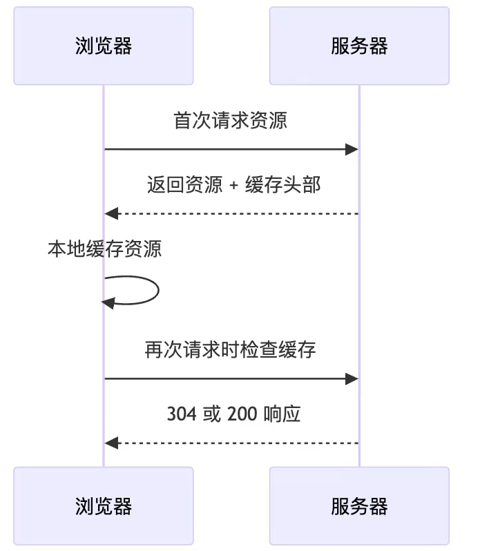

# 缓存机制

## http 缓存

缓存核心目标：复用资源、减少延迟、节省带宽



浏览器在请求资源前，会先检查本地缓存，这些缓存分为：

1. 命中强缓存：`Cache-Control`,无需请求服务器,直接使用本地资源

- max-age=233455
- public:允许代理缓存
- private：仅用户缓存
- no-cache:启用协商缓存
- no-store:禁用所有缓存
- immutable:资源永久不变

2. 命中协商缓存：需要向服务器验证有效性

> 强缓存失效或者禁用后，浏览器进入协商缓存阶段，会向服务器发送验证请求

### 协商缓存

#### 时间对比

1. 浏览器返回资源和修改时间：`Last-Modified`
2. 浏览器请求时携带`If-Modified-Since`
3. 如果时间一致则返回 304，否则返回 200

#### 文件内容对比

1. 浏览器返回资源文件和唯一内容标识符 `ETag`
2. 浏览器验证：`If-None-Match`

> ETag 优先级高于 Last-Modified

## Service Worker 可编程缓存方案

独立于网页运行的后台 js 脚本，可以拦截网络请求，实现自定义缓存逻辑，结合 Cache Api 提供**离线访问**和**动态缓存更新**，实现多种缓存策略：

1. 优先读取网络请求
2. 优先读取缓存
3. stale-while-revalidate:先立刻返回缓存，同时在后台发起网络请求更新缓存；下次再访问就能拿到更新后的内容

::: code-group

```js [service worker]
const CACHE_NAME = "PWA_SW_DEMO_V1";
const CACHE_LIST = [
  `/static/js/bundle.js`,
  "/manifest.json",
  "/favicon.ico",
  "/logo192.png",
  "/",
];
this.addEventListener("install", (event) => {
  // 安装过程要等里面这个 Promise 完成，才算安装成功
  event.waitUntil(
    caches.open(CACHE_NAME).then((cache) => {
      return cache.addAll(CACHE_LIST);
    })
  );
});
// 拦截请求
this.addEventListener("fetch", (event) => {
  // 返回的 Promise 会成为这次请求的响应
  event.respondWith(
    caches.match(event.request).then((cacheRes) => {
      console.log("搜索缓存响应", cacheRes);
      if (!!cacheRes) return cacheRes;
      return fetch(event.request).then((res) => {
        console.log("fetch响应到缓存", res);
        if (!res || res.status !== 200) {
          console.error("响应未被接受");
          return res;
        }
        const res4Cache = res.clone();
        caches.open(CACHE_NAME).then((cache) => {
          console.log("cache", event.request, res4Cache);
          return cache.put(event.request, res4Cache);
        });

        return res;
      });
    })
  );
});
// 清理旧版本缓存，只保留白名单里的缓存
this.addEventListener("activate", (event) => {
  const whiteList = [CACHE_NAME];
  event.waitUntil(
    caches.keys().then((cacheNames) => {
      return Promise.all(
        cacheNames.map((name) => {
          if (!whiteList.includes(name)) {
            return caches.delete(name);
          }
        })
      );
    })
  );
});
```

```ts [service worker注册]
const URL_SW = `${process.env.PUBLIC_URL}/serviceWorker.js`;

export function register() {
  if ("serviceWorker" in navigator) {
    window.addEventListener("load", () => {
      navigator.serviceWorker.register(URL_SW).then((res) => {
        console.log("service worker 注册结果", res);
      });
    });
  }
}
```

:::

## 最佳实践

- 静态资源(带版本号)采用强缓存
- 主入口文件(index.html)引用了其他静态资源，采用`Cache-Control:no-cache`
- 动态数据(api)按业务灵活配置 no-store 或者 较短的 max-age
- 离线缓存和复杂策略：service worker
