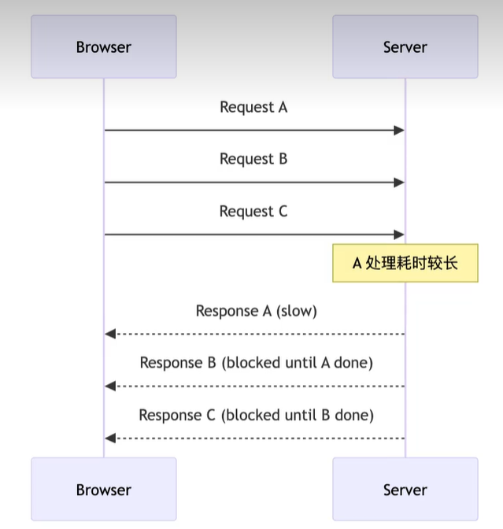

# http 协议优化

## http1.1

- 所有请求都必须在一个 TCP 连接上**按顺序**同步处理
- 为了优化，浏览器只能在同一个域名下创建 6 个并行的 TCP 连接，但多连接开销巨大

### 队头阻塞

在上图中，请求 A 因为服务器处理慢或者网络原因阻塞会导致 B/C 即使已经处理好了也不能返回给浏览器，这就是队头阻塞

## http2 协议

### 多路复用

- 单个 TCP 连接上并发多个通道(流 stream)，每个流对应一个请求/响应对，有自己的 Stream ID
- 每个流的请求/响应(http 报文)被拆分为多个二进制帧(Frame)交错发送，最终接收端依据 Stream ID 将帧重新组装

> 帧分为放置请求响应头的 Headers 帧；放置实体数据的 Data

#### 优化

1. 通过一个 TCP 连接实现并发请求，降低了连接开销，解决了 http1 的队头阻塞问题
2. 同时请求大文件和小文件，小文件不会被卡在后面

### 头部压缩

多路复用增加了 http 头部的开销，引入了`hpack压缩`解决问题。

客户/服务端会共同维护一个字典，对于 cookie/user-agent 这种重复的请求头，只会发送一个索引编号减少每次请求的字节数，在多路复用场景下，频繁小请求的开销更低

::: danger
HTTP2 基于 TCP，而 TCP 要求字节流必须可靠、有序传输。在多路复用场景下，所有流的帧最终仍被封装在同一个 TCP 字节流中。如果出现网络丢包，其他流必须等待丢失分段重传完成，这就是 **TCP 层的队头阻塞**。
:::

## http3 和 Quic 协议

http3 运行在基于 UDP(无连接、不可靠、无序) 的 Quic 协议之上

### 解决 http2 队头阻塞

Quic 协议基于 UDP 自行实现了可靠传输，每个请求对应一个独立的 Stream,他们并行传输，单个 Stream 丢包不会阻塞其他 Stream

### 连接建立速度增快

传统 https 通信，连接需要 TCP 三次握手,需要 1RTT，然后再进行 TLS 握手，需要 1-2RTT;总计需要 2-3RTT 才能正式传输数据。

Quic 合并了传输层握手和加密握手，首次连接只需要 1RTT;并且第一次连接就可以携带加密后的业务数据

### 无缝连接迁移

网络从无线切换到 5G 网络，IP/端口发生变化，将`源 IP + 源端口 + 目的 IP + 目的端口`作为唯一标识的 TCP 会强制断开所有连接后重建；Quic 使用 ConnectionID 作为唯一标识，不受 IP/端口影响，网络切换时连接仍然保持，下载/视频流不会中断

### 拥塞控制和丢包恢复

> 拥塞控制就是协议在传输数据时动态调整发送速率，保证网络稳定、效率高且丢包率低。

- TCP 的拥塞控制是在操作系统内核实现的，更新迭代缓慢
- Quic 的拥塞控制运行在用户态，在浏览器内实现，可以快速迭代

Quic 每个流独立检测丢包，可以使用更高效的重传策略；支持丰富的 ACK 格式，可以准确定位丢包区间
