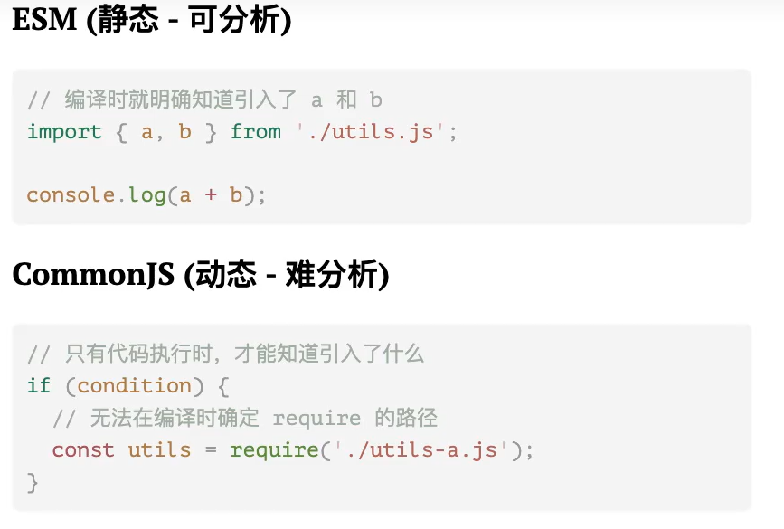

# tree shaking

核心：**编译**的时候从入口文件开始静态分析代码，**移除**没有被实际引用的代码

## 工作原理：

- ES Module 的静态结构：import 和 export 语法是静态的，只能在模块顶层使用，不能在函数或者条件分支里使用，所以模块依赖关系在编译的时候即可确定
- 构建工具的分析和标记能力：遍历代码进行标记,生成最终 bundle 的时候，所有未被标记的死代码都会被舍弃，不会被打包进去



## tree-shaking 失效

某个模块在被导入时，除了导出，还会执行一些对外部环境产生影响的操作(副作用)

```js
// logger.js
console.log("Logger module loaded"); // 副作用：输出日志
window.globalData = 123; // 副作用：修改全局变量
document.body.style.background = "red"; // 副作用：操作 DOM

export function log(msg) {
  console.log(msg);
}
```

构建工具无法判断这些副作用是否有用，出于安全考虑,即使没有 import 任何东西，tree-shaking 也不会移除这个模块，即 tree-shaking 表现为失效

### 解决方案

1. package.json 声明整个包都没有副作用
2. 指定副作用文件

```json
{
  "sideEffects": false
}
{
  "sideEffects": [
    "./src/utils.js",
    "*.css"
  ]
}
```
