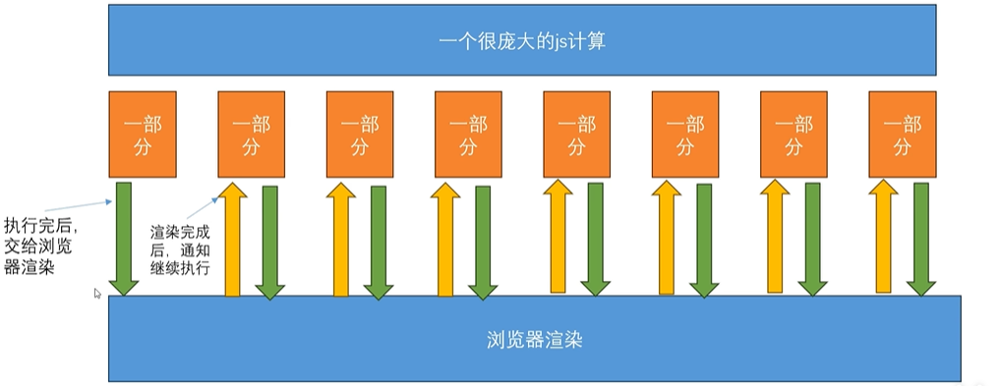

# 长任务优化

::: tip
长任务：指在浏览器**主线程**上执行超过 **50ms** 的任务
:::

## 任务分片



原理：将大任务拆分成多个小块，在事件循环的间隙中执行;执行时间没有缩短，但是不会出现卡顿现象

途径： `requestAnimationFrame`

场景： 动画、视觉更新，实时数据可视化(websocket 推送数据的图表绘制)

> requestAnimation 定义的任务，会在浏览器渲染完成后执行，所以只需要把每个切片放到 requestAnimation，他在执行完一个后，会等着浏览器渲染完成后下一帧渲染前再执行一个

```tsx
import { useEffect, useState } from "react";

interface DataType {
  id: number;
  name: string;
  status: number;
  checked: boolean;
  age: number;
}
const TodoList = () => {
  const [data, setData] = useState<Array<DataType>>([]);
  const [checkedList, setCheckedList] = useState<number[]>([]);
  const sliceRender = (index: number, data1: DataType[]) => {
    requestAnimationFrame(() => {
      let target = index + 500;
      for (; index < target; index++) {
        data1.push({
          id: index,
          name: "张三" + Math.floor(Math.random() * 20),
          status: Math.floor(Math.random() * 18),
          checked: false,
          age: Math.floor(Math.random() * 18),
        });
      }
      setData([...data1]);
      if (index < 50000) {
        sliceRender(target, data1);
      }
    });
  };
  useEffect(() => {
    sliceRender(0, []);
  }, []);
  const chooseAll = (event) => {
    let index = 0;
    const checked: number[] = [];
    function sliceChecked() {
      requestAnimationFrame(() => {
        let target = index + 500;
        for (; index < target; index++) {
          checked.push(data[index].id);
        }
        setCheckedList([...checked]);
        if (index < data.length) {
          sliceChecked();
        }
      });
    }
    if (event.target.checked) sliceChecked();
    else setCheckedList([]);
  };
  return (
    <>
      <table>
        <thead>
          <tr>
            <td>
              <input type="checkbox" onChange={chooseAll} />
              全选
            </td>
            <td>名字</td>
            <td>年龄</td>
            <td>状态</td>
            <td>操作</td>
          </tr>
        </thead>
        <tbody>
          {data.map((item) => {
            return (
              <tr key={item.id}>
                <td>
                  <input
                    type="checkbox"
                    onChange={() => {}}
                    checked={checkedList.includes(item.id)}
                  />
                </td>
                <td>{item.name}</td>
                <td>{item.age}</td>
                <td>{item.status}</td>
                <td>{item.checked}</td>
              </tr>
            );
          })}
        </tbody>
      </table>
    </>
  );
};

export default TodoList;
```

## web worker

原理：将计算密集型且不直接操作 DOM 的任务，给一个独立的**后台线程**去处理，不阻塞主线程

途径：`postMessage`,`onmessage`异步通信

应用场景：后台管理系统某个页面需要将 10 万条数据导出为 excel 表格，canvas 滤镜

注意点：

1. webWorker 不能使用本地文件，必须是网络上的同源文件
2. webWorker 不能有 dom 相关的内容，dom 相关的只能放在主线程，webWorker 只能做计算相关操作
3. webWorker 不能传递方法，导入模块应该用`importScripts("a.js")`,参数必须是网络上的地址

### canvas 滤镜

::: code-group

```js [主线程]
  const worker1 = new Worker("/list.js");
  const ref = useRef<HTMLCanvasElement | null>(null);
  const ctx = useRef<CanvasRenderingContext2D | null>(null);
    useEffect(() => {
    const img = new Image();
    img.src = logo;
    img.onload = () => {
      ctx.current = ref.current?.getContext("2d") || null;
      ctx.current?.drawImage(img, 0, 0, 1800, 900);
    };
  }, []);
    // canvas滤镜
  const imgHandler = () => {
    const imageData = ctx.current?.getImageData(0, 0, 1800, 900) as ImageData;

    worker1.postMessage(imageData);
    worker1.onmessage = (event) => {
      console.log("主线程收到消息", event.data);
      ctx.current?.putImageData(event.data, 0, 0);
    };
  };
```

```js [计算任务]
/* eslint-disable no-restricted-globals */
self.onmessage = (event) => {
  console.log("工人收到消息", event.data);
  const imageData = event.data;
  const data = imageData?.data || [];
  for (let i = 0; i < data?.length; i++) {
    for (let j = 0; j < 1000; j++) {
      if (imageData.data[i] !== 255) {
        imageData.data[i] = Math.min(data[i] + j, 0);
      }
    }
  }
  self.postMessage(imageData);
};
```

:::

### 将数据导出到本地 excel

::: code-group

```ts [组件]
import { Button } from "antd";
import { useEffect, useState } from "react";
import { writeFile } from "xlsx";

const worker1 = new Worker("/excelWorker.js");
const TodoList = () => {
  const [loading, setLoading] = useState(false);
  const exportExcel = () => {
    setLoading(true);
    worker1.postMessage("111");
  };

  useEffect(() => {
    worker1.onmessage = (event) => {
      let workbook = event.data;
      writeFile(workbook, "test.xlsx");
      setLoading(false);
    };
  }, []);
  return (
    <>
      <input />
      <Button loading={loading} onClick={exportExcel}>
        导出
      </Button>
    </>
  );
};

export default TodoList;
```

```js [excelWorker.js]
/* eslint-disable no-restricted-globals */
/* eslint-disable no-undef */
importScripts(
  "https://cdn.sheetjs.com/xlsx-latest/package/dist/xlsx.full.min.js"
);
const { utils } = XLSX;
self.onmessage = (event) => {
  const loadData = () => {
    fetch("https://jsonplaceholder.typicode.com/todos")
      .then((res) => {
        return res.json();
      })
      .then((res) => {
        const extended = Array.from({ length: 100000 }, (_, i) => ({
          ...res[i % res.length],
          id: i + 1,
        }));
        const sheet = utils.json_to_sheet(extended);
        const workbook = utils.book_new();
        utils.book_append_sheet(workbook, sheet, "Sheet1");
        self.postMessage(workbook);
      });
  };
  loadData();
};
```

:::

## requestIdleCallback

原理：利用浏览器空闲时间执行低优先级任务。在浏览器一帧的渲染工作(布局、绘制等)完成后，如果还有剩余时间，才会执行传入的回调函数

场景：数据上报

```js
const tasks = [task1, task2, task3];

function processTasks(deadline) {
  // deadline.timeRemaining()获取当前空闲时间的剩余毫秒数
  while (tasks.length > 0 && deadline.timeRemaining() > 0) {
    const task = tasks.shift();
    executeTask(task);
    console.log("空闲时间执行了一个任务");
  }
  // 如果任务还没执行完，继续请求下一个空闲时间片
  if (tasks.length > 0) {
    requestIdleCallback(processTasks);
  }
}
// 请求在下一个空闲时间段执行任务
requestIdleCallback(processTasks);
```
