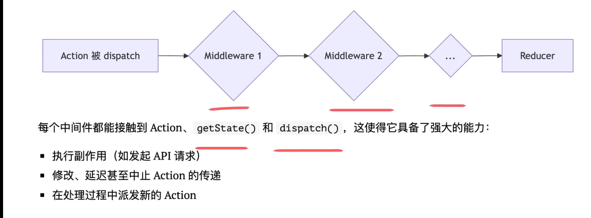

# react 状态管理

## setState 是异步 or 同步

setState 是同步提交，延迟执行：setState 函数本身是同步的，但他触发的状态更新和组件重渲染，会被 react 延迟处理和批量合并；

将多次状态更新合并为单次渲染，避免了不必要的计算和 DOM 操作，优化了应用性能；

保证在一次事件处理流程中，所有状态能够同步生效，防止出现不完整的中间 UI 状态，提升应用的健壮性。

### React 批量更新策略：

react 会将同一次事件循环中的所有 setState 调用搜集起来，放入一个队列，在事件函数执行完毕后，将所有状态更新合并，只进行一次重渲染。

React18 前，批量更新局限于 React 自身的事件处理器中，而 react18 后 setTimeout,promise 回调函数中也支持了自动批量更新。

## useState 两种更新状态的方式

1. 直接传入新的值`setCount(1)`
2. 传入一个函数，即函数式更新`setCount(prev=>prev+1)`

```jsx
import { useState } from "react";

const Demo = () => {
  const [count, setCount] = useState(0);

  const handleClick = () => {
    setCount(count + 1);
    setCount(count + 1);
    setCount(count + 1);
  };
  return (
    <>
      <div>{count}</div>
      <button onClick={handleClick}>+1</button>
    </>
  );
};

export default Demo;
```

我们预期每点击一次，count 增加 3，但实际上，最终 count 显示的是 1。原因是：

1. state 闭包陷阱：函数作用域内的 count 值，永远是当次渲染的快照 0
2. 异步与批处理：react 会将短时间内的多次 setState 调用合并处理，以优化性能

模式选择：如果新的 state 依赖旧的 state，使用函数式更新；其他情况下选择值更新

## 状态提升

核心：将多个兄弟组件共享的 state,移动到最近的共同父组件中，由父组件统一管理,形成单一数据源

副作用：父组件中的状态更新，下面的所有子组件都会重新渲染

缺点：

1. 大型应用中因为不必要的重渲染导致性能问题
2. prop 如果层级过深，会导致代码难以维护

::: code-group

```jsx [父组件]
import { useState } from "react";
import TempInput from "./TempInput";

const Demo = () => {
  const [temp, setTemp] = useState("");
  const [scale, setScale] = useState("c");
  const handleCelisChange = (num: string) => {
    setTemp(num);
    setScale("c");
  };
  const handleFelisChange = (num: string) => {
    setTemp(num);
    setScale("f");
  };
  const celsius = scale === "f" ? tryConvert(temp, toCelsius) : temp;
  const fahrenheit = scale === "c" ? tryConvert(temp, toFahrenheit) : temp;
  return (
    <>
      <TempInput scale="c" temp={celsius} onTempChange={handleCelisChange} />
      <TempInput scale="f" temp={fahrenheit} onTempChange={handleFelisChange} />
    </>
  );
};
```

```jsx [子组件]
const TempInput = (props: TProps) => {
  const { scale, temp, onTempChange } = props;
  const onChange = (event: any) => {
    onTempChange(event.target.value);
  };
  return (
    <div>
      <input value={temp} onChange={onChange} />
      {scale}
    </div>
  );
};
```

```js [util函数]
// 摄氏度 ↔ 华氏度 转换函数
const toCelsius = (f: number) => ((f - 32) * 5) / 9;
const toFahrenheit = (c: number) => (c * 9) / 5 + 32;

// 转换 + 格式化函数
const tryConvert = (value: string, convert: (v: number) => number): string => {
  const num = parseFloat(value);
  if (Number.isNaN(num)) return "";
  const output = convert(num);
  return (Math.round(output * 100) / 100).toString(); // 保留两位小数
};
```

:::

## useReducer

useState 适合简单、独立的 state，但当应用变得复杂，会出现以下情况：

1. 多个 useState 相关联，更新逻辑散落在各个地方
2. 下一个 state 的值严重关联上一个 state 的值，虽然可以使用函数式更新，但逻辑很难追踪
3. 将更新函数传递给深层子组件，会导致不必要的重渲染

此时就应该引入 useReducer,借鉴了 redux 的思想：

1. 集中管理状态
2. 分离状态变更和视图渲染，组件和逻辑分开
3. 创建可预测的状态流

```tsx
import { useReducer } from "react";
const Demo = () => {
  const [state, dispatch] = useReducer(reducer, initState);

  return (
    <>
      <div> {state.count}</div>
      <div>
        step:
        <input
          type="number"
          value={state.step}
          onChange={(e) => {
            dispatch({ type: "set_step", payload: e.target.value });
          }}
        />
      </div>
      <div>
        <button onClick={() => dispatch({ type: "up" })}>+1</button>
        <button onClick={() => dispatch({ type: "down" })}>-1</button>
        <button onClick={() => dispatch({ type: "reset" })}>reset</button>
      </div>
    </>
  );
};

export default Demo;

interface CounterState {
  count: number;
  step: number;
}
const initState: CounterState = {
  count: 0,
  step: 1,
};

function reducer(state: CounterState, action: any) {
  switch (action.type) {
    case "up":
      return { ...state, count: state.count + state.step };
    case "down":
      return { ...state, count: Math.max(0, state.count - state.step) };
    case "reset":
      return initState;
    case "set_step":
      return { ...state, step: action.payload };
    default:
      throw new Error("事变");
  }
}
```

深层传入更新函数时，父组件每次渲染，函数引用地址都会改变，破坏 react.memo 的优化 ，导致不必要的重渲染；而 useReducer 返回的 dispatch 函数在组件生命周期里引用是稳定的，所以传入深度子组件的时候，会有效配合 react.memo 进行性能优化。

## useContext

核心机制：广播，当 provider 的 value 变化时，所有消费该 context 的组件都会重渲染

问题：某个消费组件只依赖于 value 对象中的一小部分，那一部分并没有变化，但由于广播机制，依旧会被强制重渲染。

解决方案：

1. 拆分大 context 拆分为多个小 context，同时使用 useMemo 确保只在依赖发生变化时， value 对象的引用才会更新

```jsx
const UserContext = createContext(null);
const ThemeContext = createContext(null);

const userVale=useMemo(()=>{return {user,setUser}},[user])
const themeVale=useMemo(()=>{return {theme,setTheme}},[theme])

<UserContext value={userVale}>
  <ThemeContext value={themeVale}>
    <Content />
  </ThemeContext>
</UserContext>
```

2. 利用 children prop 将不依赖 context 的昂贵组件作为一个 children 传入 provider

```js
const ThemeContext = createContext(null);

const ThemeProvider = ({ children }) => {
  const [theme, setTheme] = useState("light");
  const themeValue = useMemo(() => {
    return { theme, setTheme };
  }, [theme]);
  return <ThemeContext value={themeValue}>{children}</ThemeContext>;
};

//使用
<ThemeProvider>
  <CommonContent />
</ThemeProvider>;
```

> React 渲染机制：如果组件的 props 引用没有变化，则 React 会倾向于跳过他的更新

3. 将易变的状态(state)和稳定的更新函数(dispatch)拆分为两个 context

```jsx
const [state, dispatch] = useReducer(reducer, {});

<StateContext value={state}>
  <DispatchContext value={dispatch}>
    <Content />
  </DispatchContext>
</StateContext>;
```

## redux

核心思想：

1. 单一数据源：所有状态都保存在一个 store 对象树中
2. state 只读：只能通过 action 修改意图
3. 纯函数变更：用 reducer 计算新状态并返回
4. 单项数据流:

### 数据流流向

当用户在 View 中触发 dispatch 时，会生成一个 Action，Action 会经过 middleware 到达 Store。Store 会把当前 state 和 action 传给 reducer，reducer 返回新的 state。Store 更新 state 后通知订阅的组件，组件重新从 store 取数据并渲染。

> 流程是 View → Action → Reducer → Store → View 的闭环。

选择原则：

- 单组件简单状态 → useState
- 逻辑复杂、状态依赖 → useReducer
- 跨组件小型共享状态 → useContext + useReducer
- 大型应用、跨模块共享、异步/调试 → Redux / RTK

## redux 中间件

问题：redux 的 reducer 是一个纯函数，只负责计算新 state。但实际开发场景中，一些副作用：异步操作比如 api 请求、定时器是不可避免的。

如果放在 reducer 违背了 redux 核心原则，但放在 react 组件中又会让业务逻辑和 UI 逻辑混在一起，代码可维护性降低。



## 新型状态管理库

- zustand:自上而下的全局状态管理，等同于轻量级 redux，
  - 极简化 api，去除了 redux 中的模板代码比如 dispatch，action,reducer,将所有逻辑都封装在 create 函数里
  - 状态是全局的，不依赖 react context，不需要在应用根部用 provider 包裹
  - 组件通过 selector 函数订阅状态的一部分，只有被订阅的状态变化时组件才会重渲染
- jotai:自下而上的原子化状态管理，贴近 react 的组件化思维
  - 状态被组织成细粒度的 atom
  - useAtom 的 api 设计和 useState 一致，降低学习门槛
  - 自动构建 atom 之间的依赖图，当一个 atom 更新时，只有精确依赖于他的组件才会重新渲染，不需要手动写 selector

::: code-group

```js [zustand]
import { create } from "zustand";

const useBearStore = create((set) => ({
  bears: 0,
  increasePopulation: () => set((state) => ({ bears: state.bears + 1 })),
  removeAllBears: () => set({ bears: 0 }),
}));

//组件中获取目标状态
function BearCounter() {
  const bears = useBearStore((state) => state.bears);
  return <h1>{bears} around here ...</h1>;
}
//组件中修改目标状态
function Controls() {
  const increasePopulation = useBearStore((state) => state.increasePopulation);
  return <button onClick={increasePopulation}>one up</button>;
}
```

```js [jotai]
import { atom } from "jotai";

const priceAtom = atom(10);
const doubleAtom = atom((get) => get(priceAtom) * 2);

//组件中使用
function Controls() {
  const [count, setCount] = useAtom(priceAtom);
}
```

:::

## Redux-toolkit 能写可变数据

Immer 用 Proxy 代理草稿（draft），记录对它的所有“可变操作”（如 push/赋值），
最后根据这些操作“生成一个新的不可变对象”，而不是修改原 state
